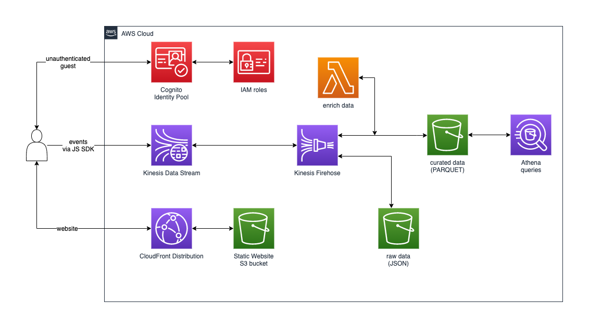
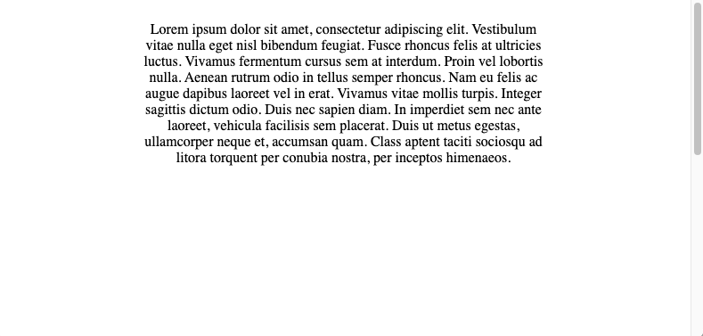

# Welcome to Web Events Ingestion Project

This project aims to be a working proof of concept of web browser generated events ingestion, using Amazon Kinesis JS SDK, enriched via AWS Lambda and being persisted in Amazon S3, for later querying using Amazon Athena, or alike.

## Requirements

* Setup AWS credentials for your environment: [instructions here](https://docs.aws.amazon.com/cli/latest/userguide/cli-configure-files.html)
* Install AWS SAM CLI: [instructions here](https://docs.aws.amazon.com/serverless-application-model/latest/developerguide/install-sam-cli.html)
* Install AWS CDK Toolkit: [instructions here](https://docs.aws.amazon.com/cdk/v2/guide/cli.html)

## Architecture



## Deployment

* `deploy.sh` file has been tailored for easier CDK deployment ([jq](https://jqlang.github.io/jq/ ) needs to be installed)

## Undeployment

* `destroy.sh` includes a one-liner script to delete the CDK created CloudFormation stack and associated resources.

PS: It won't automatically destroy S3 buckets so you can later check the stored contents

## Usage 

Once `deploy.sh` has executed successfully, you can test the sample by opening in a web browser the URL of the generated CloudFront distribution, which can be found in the `outputs.json` file, under the `distributionDomainName` key, as in the following example:

Sample `outputs.json` file:

```
{
  "EventsStack": {
    "bucket": "eventsstack-bucket839087e7-157fkwiz3i4cr",
    "distributionId": "E37A62Z43LTGA",
    "distributionDomainName": "d21i53hqr1nkq2.cloudfront.net",
    "poolId": "us-west-1:f27dc64f-03d7-4638-6a76-f41d8f1e6d67",
    "region": "us-west-1",
    "streamName": "EventsStack-ClickStream12632BE-7gJVwrI4dsG"
  }
}
```

From that file, the domain is `d21i53hqr1nkq2.cloudfront.net` and the URL https://d21i53hqr1nkq2.cloudfront.net

Once you open that URL, a screen like the following will be rendered:



If you resize the browser window small enough to make the vertical scrolling bar appear and, you do scroll down & up a few times, events will be triggered. These will be sent to Kinesis Data Streams and, could be found later inside the bucket referenced from the `outputs.json` file (`eventsstack-bucket839087e7-157fkwiz3i4cr` from sample above)

## CDK

The `cdk.json` file tells the CDK Toolkit how to execute your app. The build step is not required when using JavaScript.

### Useful commands

* `npm run test`         perform the jest unit tests
* `cdk deploy`           deploy this stack to your default AWS account/region
* `cdk diff`             compare deployed stack with current state
* `cdk synth`            emits the synthesized CloudFormation template

## Reference links
- [Create real-time clickstream sessions and run analytics with Amazon Kinesis Data Analytics, AWS Glue, and Amazon Athena](https://aws.amazon.com/blogs/big-data/create-real-time-clickstream-sessions-and-run-analytics-with-amazon-kinesis-data-analytics-aws-glue-and-amazon-athena/)
- [Capturing Web Page Scroll Progress with Amazon Kinesis](https://docs.aws.amazon.com/sdk-for-javascript/v2/developer-guide/kinesis-examples-capturing-page-scrolling.html)

## Security

See [CONTRIBUTING](CONTRIBUTING.md#security-issue-notifications) for more information.

## License

This library is licensed under the MIT-0 License. See the [LICENSE](LICENSE) file.